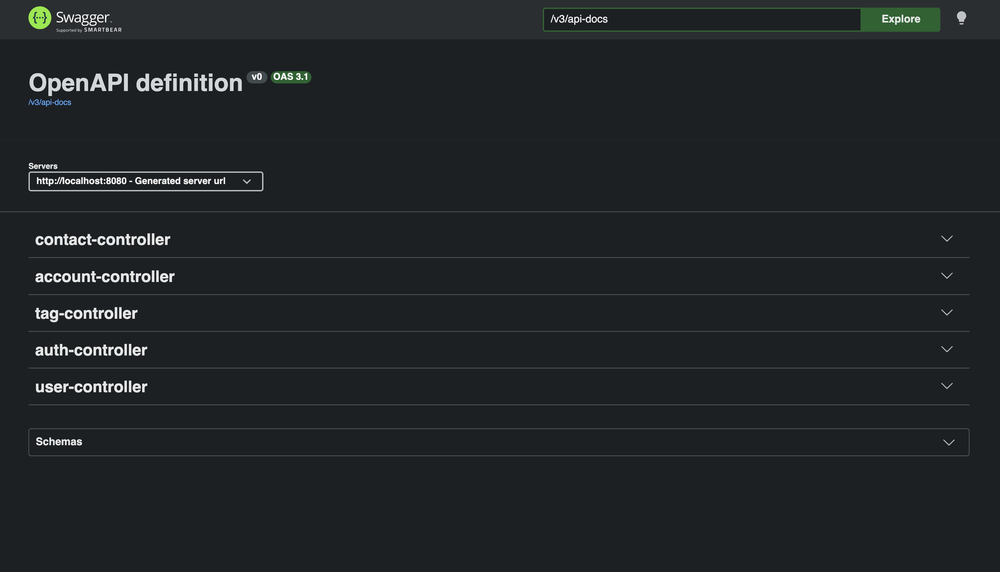
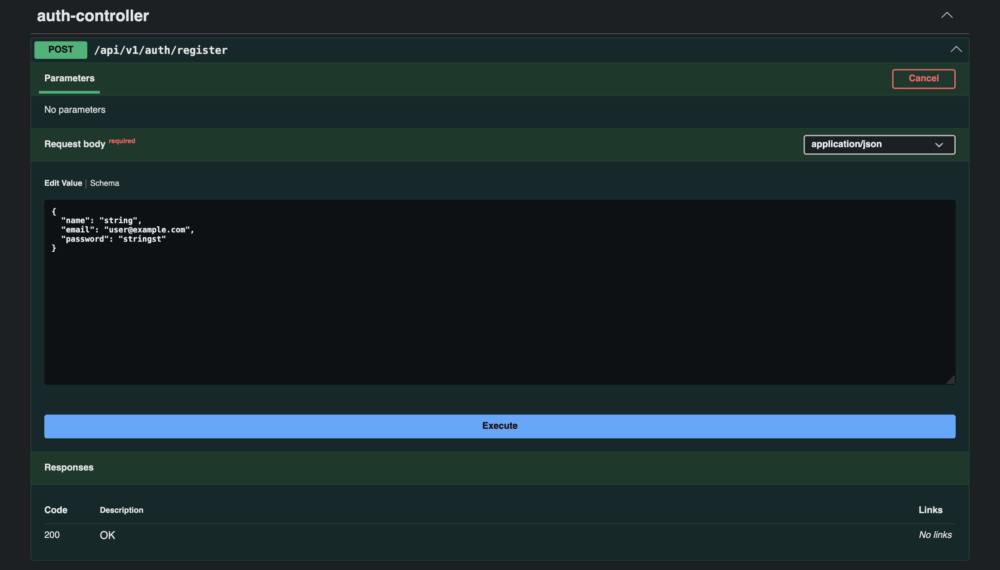

# MoneyTrail


MoneyTrail is a self-hosted personal finance application built with Java and Spring Boot.
It models all money movement as transfers between accounts — income, expenses, investments,
loans, and lending to external contacts — using a double-entry bookkeeping system.
The domain model is designed with multi-user support in mind for future versions.

## Tech stack

- Java 21
- Spring Boot 3 (security, data, validation, Web, Jupiter Test)
- PostgreSQL
- Flyway
- JWT
- Lombok

## Architecture
[Architecture documentation](./docs/architecture.md)

## Status
Under active development — v0.0.1

| Feature      | Status               | Remarks        |
|--------------|----------------------|----------------|
| Auth         | Implemented & tested ||
| Accounts     | Implemented & tested ||
| Contacts     | Implemented & tested ||
| Tags         | Implemented & tested ||
| Transactions | Planned              ||
| Dashboard    | Planned              ||

## How to run

### Prerequisites
- Java 21 or higher
  - https://www.javathinking.com/blog/how-to-install-jdk-21/

### Steps to run
- Clone the project from `git clone https://github.com/suvankar-mitra/moneytrail`
- Go to the project root directory: `cd moneytrail`
- Execute below commands to generate `dev` profile:
  - `cd src/main/resources/`
  - `cp ./application.yml ./application-dev.yml`
  - Generate Base64 encoded secret: `openssl rand -base64 128`
  - Replace `${JWT_SECRET}` from application-dev.yml with the above `generated Base64 secret`, remember the string will not have any newlines in it.
- With above steps, the resources folder will look like this:
  ```
  src/main/resources
  ├── application-dev.yml                     <== New file
  ├── application.yml
  ├── db
  │   └── migration
  │       ├── V1__create_users.sql
  │       ├── V2__create_contacts.sql
  │       ├── V3__create_accounts.sql
  │       ├── V4__create_transactions.sql
  │       ├── V5__create_tags.sql
  │       ├── V6__create_transaction_tags.sql
  │       └── V7__create_refresh_tokens.sql
  ├── static
  └── templates
  ```
- Now you can start the application with:
  - `cd ../../../`
  - `./mvnw spring-boot:run -Dspring.profiles.active=dev`

## Screenshots (Swagger UI)




## Licensing

This project is licensed under the [GNU Affero General Public License v3.0](LICENSE).  
For commercial use, please contact [Suvankar Mitra](https://hello.suvankar.cc).
